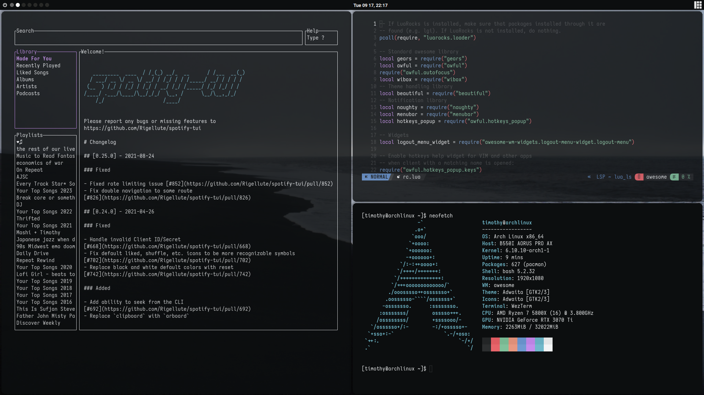
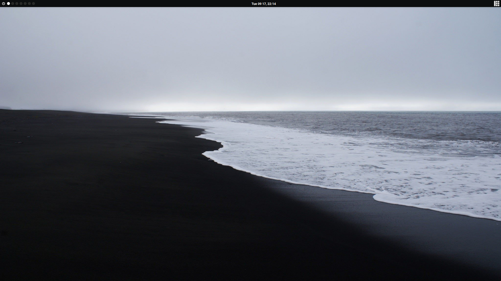

# Stoic-Dotfiles
Simple dotfiles for AwesomeWM, with heavy inspirition from 夜 - Yoru (https://github.com/rxyhn/yoru)




<br>
<!-- SETUP -->

## :wrench: ‎ <samp>Setup</samp>

> This is step-by-step how to install the dotfiles.

<details>
<summary><b>1. Install Required Dependencies</b></summary>
<br>

:warning: ‎ **This setup instructions only provided for Arch Linux (and other Arch-based distributions)**

> First of all you should install the [git version of AwesomeWM](https://github.com/awesomeWM/awesome/).

```sh
yay -S awesome-git
```

> Install necessary dependencies

```sh
yay -Sy picom-git wezterm rofi lxappearance-gtk3 xclip redshift betterlockscreen maim feh 
```
</details>

<details>
<summary><b>2. Install The Dotfiles</b></summary>
<br>

> Clone this repository

```sh
git clone --depth 1 --recurse-submodules https://github.com/timothfee/stoic-dotfiles.git
cd awesome-dotfiles && git submodule update --remote --merge
```

> Copy config files

```sh
cp -r config/* ~/.config/
```

> Install a few fonts (mainly icon fonts) in order for text and icons to be rendered properly.

Necessary fonts:

- **Roboto** - [here](https://fonts.google.com/specimen/Roboto)
- **Material Design Icons** - [here](https://github.com/google/material-design-icons)
- **Icomoon** - [here](https://www.dropbox.com/s/hrkub2yo9iapljz/icomoon.zip?dl=0)


Once you download them and unpack them, place them into `~/.fonts` or `~/.local/share/fonts`.

Or you can find the required fonts inside the `misc/fonts` folder of this repository.

```sh
cp -r misc/fonts/* ~/.fonts/
# or to ~/.local/share/fonts
cp -r misc/fonts/* ~/.local/share/fonts/
```

And run this command for your system to detect the newly installed fonts.

```sh
fc-cache -fv
```
> Install NVChad (https://nvchad.com/docs/quickstart/install)
```sh
git clone https://github.com/NvChad/starter ~/.config/nvim && nvim
```

> Finally, now you can login with AwesomeWM

Congrats. :tada:

Log out from your current desktop session and log in into AwesomeWM.

</details>
